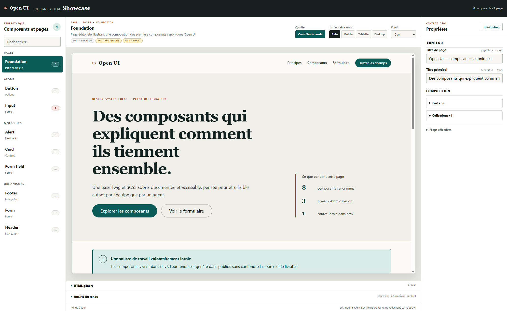

# Open UI



Open UI est un workspace de design system pensé pour être lu et manipulé autant par des développeurs que par des agents. Les composants et les pages sont décrits par un contrat JSON, rendus avec Twig, stylés en SCSS et consultables dans un Showcase interactif.

Le projet peut démarrer sans aucun composant : `dev/` peut être vide et `public/` absent. Le Showcase reste disponible et présente alors un état de démarrage explicite.

## Prérequis

- Node.js 22 ou plus récent recommandé ;
- npm, fourni avec Node.js.

## Installation

Depuis la racine du dépôt :

```bash
npm ci
npm run dev
```

Ouvrir ensuite :

- `http://localhost:3000/` pour l’index du workspace ;
- `http://localhost:3000/showcase/` pour le design system interactif.

Sous PowerShell, si l’exécution de `npm.ps1` est bloquée par la stratégie système, utilisez directement l’exécutable Windows :

```powershell
npm.cmd ci
npm.cmd run dev
```

Cette solution ne demande aucune modification de la stratégie d’exécution PowerShell.

## Démarrage depuis un workspace vide

Aucune commande d’initialisation n’est nécessaire. Le moteur du Showcase est livré et versionné dans `showcase/`.

- `dev/` est la racine structurelle des sources projet. Le dépôt conserve `dev/.gitkeep`, mais son contenu est actuellement ignoré par Git.
- `public/` est une sortie générée. Vite le crée automatiquement pendant le build.
- `showcase/` contient l’outil système : catalogue des composants et pages, inspecteur de propriétés, iframe de rendu et affichage du HTML courant.
- La feuille `dev/assets/scss/style.scss` est facultative au départ. Le Showcase utilise une feuille vide tant qu’elle n’existe pas, puis charge automatiquement les styles du projet lorsqu’elle est créée.

Un workspace sans composant n’est donc pas une erreur : le catalogue affiche `0` et guide la création du premier composant.

## Ajouter un premier composant

Chaque composant canonique vit dans son propre dossier :

```text
dev/components/button/
|- button.json
|- button.twig
`- button.md
```

Les styles associés vivent dans :

```text
dev/assets/scss/components/_button.scss
dev/assets/scss/style.scss
```

Le JSON décrit les métadonnées, variantes et contenus modifiables. Le Showcase transforme ces déclarations en contrôles humains, rerend le Twig à chaque modification et maintient le HTML affiché à jour.

Le contrat complet est documenté dans [GUIDELINES_AI.md](./GUIDELINES_AI.md) et [docs/component-model.md](./docs/component-model.md).

Une page suit le même principe dans `dev/pages/` : `[nom].json` expose ses variantes et contenus, tandis que `[nom].twig` produit un document HTML complet. Le Showcase la présente dans une section `Pages` distincte et rerend le document à chaque modification.

## Contrôler la qualité du rendu

Dans le Showcase, Axe analyse automatiquement chaque nouveau rendu après une courte temporisation. Le bouton `Contrôler le rendu` relance Axe et ajoute la validation HTML W3C sur la variante de composant ou de page actuellement affichée :

- **Nu HTML Checker** contrôle un composant dans un document HTML minimal ou une page comme document complet ;
- **Axe** contrôle localement les règles d’accessibilité automatisables dans l’iframe, y compris la structure globale lorsqu'une page est sélectionnée, sans envoyer le DOM à un service externe.

Le panneau conserve séparément les erreurs HTML, les violations Axe et les vérifications RGAA manuelles. Un résultat sans erreur est formulé `Aucune erreur automatique détectée` : il ne constitue jamais une preuve de conformité RGAA.

Par défaut, le HTML rendu est transmis au service officiel `https://validator.w3.org/nu/`. Aucun JSON, Twig ou SCSS n’est envoyé. Pour utiliser une instance Nu locale ou privée, configurez son URL avant de lancer Vite :

```powershell
$env:OPENUI_W3C_VALIDATOR_URL = 'http://localhost:8888/'
npm.cmd run dev
```

```bash
OPENUI_W3C_VALIDATOR_URL=http://localhost:8888/ npm run dev
```

Si le service Nu est indisponible, le Showcase affiche un contrôle HTML partiel sans bloquer l’analyse Axe locale.

## Architecture

```text
open-ui/
|- dev/          sources locales du projet utilisateur
|- showcase/     application système versionnée
|- scripts/      validation, cartographie, impact et génération
|- docs/         contrats et décisions d’architecture
`- public/       rendu généré par Vite
```

Le Showcase ne réécrit jamais les JSON : les modifications faites dans son formulaire sont temporaires. Le rendu Twig live et son API nécessitent `npm run dev` ; ils ne fonctionnent pas en ouvrant les fichiers avec `file://`.

## Commandes utiles

| Commande | Rôle |
|---|---|
| `npm run dev` | Lance Vite, le Showcase et les mises à jour live |
| `npm run build` | Génère le rendu dans `public/` |
| `npm run validate` | Valide les contrats JSON, y compris un workspace vide |
| `npm run test` | Lance les tests automatisés |
| `npm run test:empty` | Construit une copie temporaire sans `dev/` ni `public/` |
| `npm run lint:scss` | Vérifie les sources SCSS présentes |
| `npm run list` | Liste les composants et les pages détectés |
| `npm run impact -- <composant>` | Cartographie les usages d’un composant |
| `npm run clean` | Supprime la sortie générée `public/` |

`npm run build` remplace le contenu existant de `public/`. Ce dossier est ignoré par Git pendant le développement actuel ; lorsqu’il deviendra un livrable de production versionné, il faudra retirer sa règle du `.gitignore`.

## Principes du projet

- Réutiliser un composant ou une variante avant d’en créer un nouveau.
- Garder le JSON comme contrat des variables exposées.
- Garder Twig concentré sur le rendu, sans logique métier.
- Utiliser les tokens SCSS et intégrer l’accessibilité dès la conception.
- Vérifier les impacts avant toute modification d’un composant partagé.
